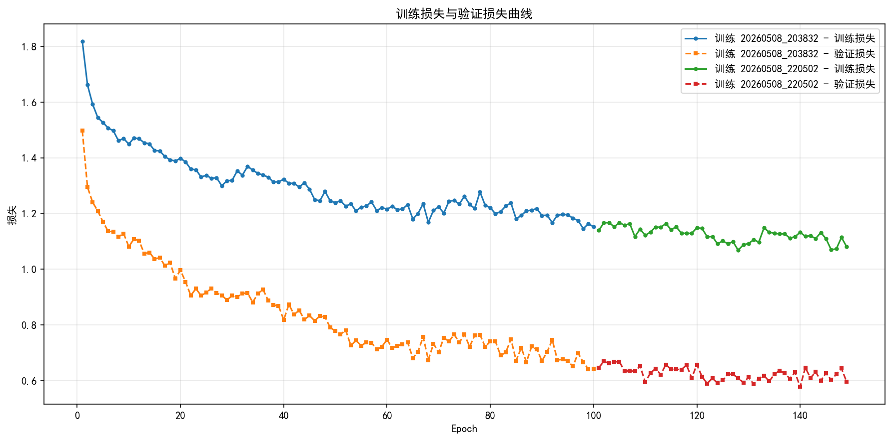
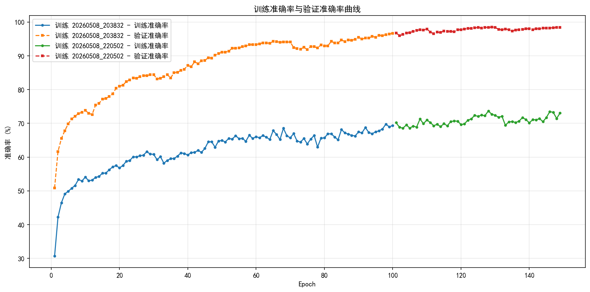
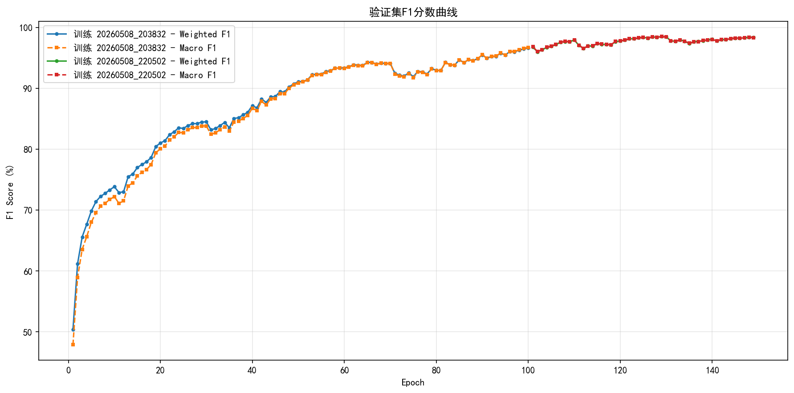
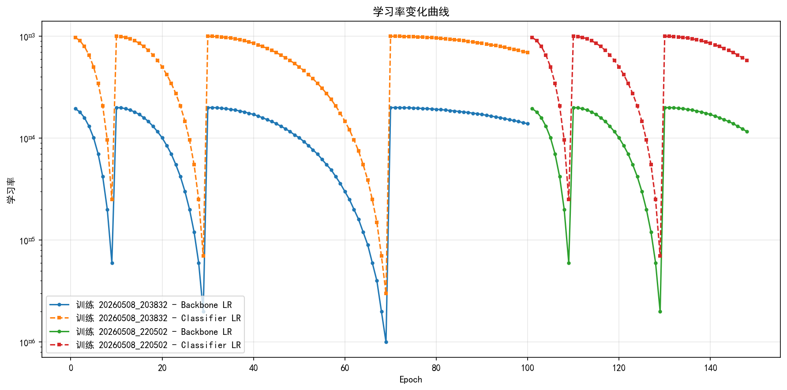
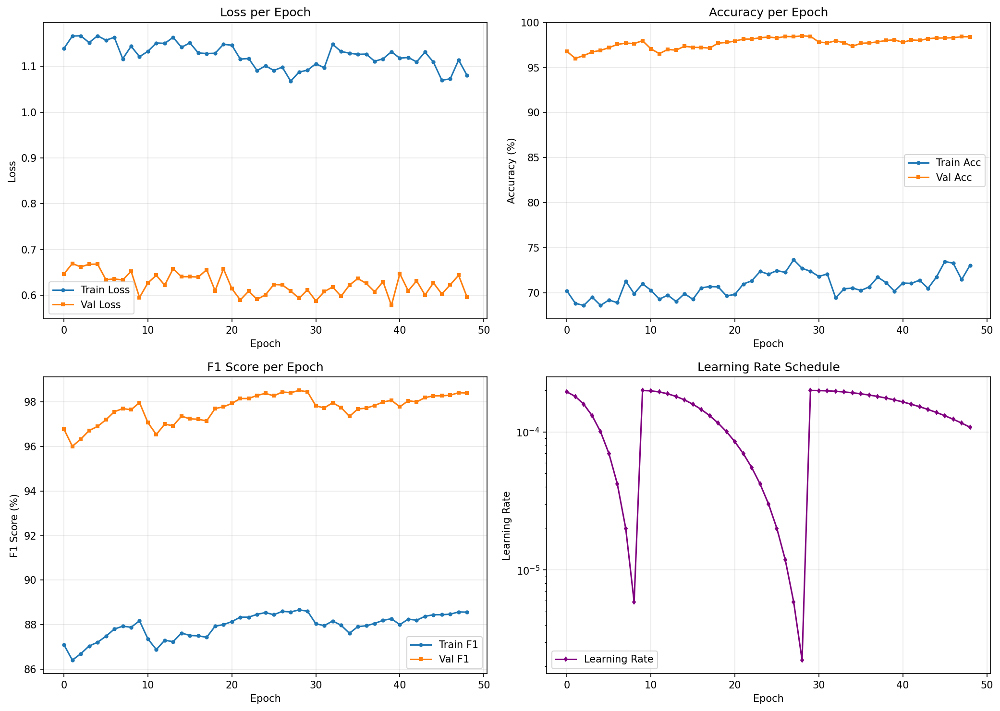
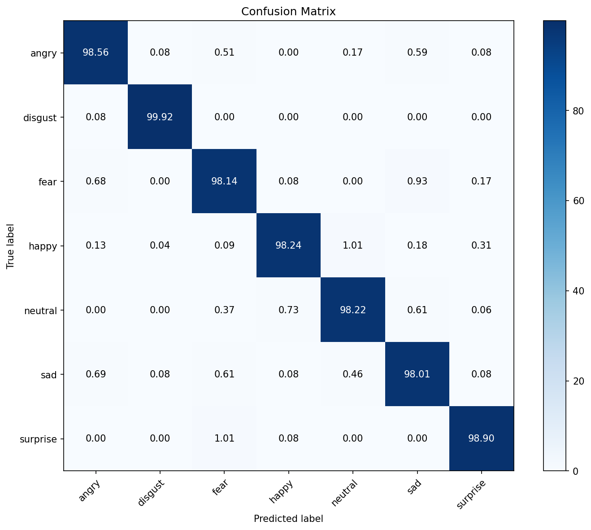

# FaceEmotion-AI

> **智能面部情绪识别系统**  
> 基于深度学习的实时情绪检测平台，支持多模态人脸情绪识别、AI 自适应学习与可视化数据分析

[](https://www.python.org/)
[](https://fastapi.tiangolo.com/)
[](https://vuejs.org/)
[](LICENSE)

---

## 📖 项目简介

FaceEmotion-AI 是一个全栈 AI 情绪识别系统，结合了计算机视觉、深度学习和前端可视化技术。系统能够实时检测和分析面部情绪，提供智能化的情绪反馈、自适应学习与数据可视化分析。

### 📝 更新日志

**V3.1.0 (2026-05-08)**

- ✅ **WebSocket 稳定性修复**
  - 修复了 ping/pong 心跳检测机制，后端现在正确响应心跳消息
  - 修复了停止摄像头检测时持续重连的问题
  - 修复了 WebSocket 关闭码错误（1011 → 1000）
  - 添加了优雅关闭连接方法，支持主动断开连接不触发重连

- ✅ **UI 体验优化**
  - 添加了左侧边栏按钮鼠标悬停提示功能
  - 顶部栏面包屑导航优化（左侧英文/右侧中文，去掉边框，字体放大）
  - 所有 emoji 表情图标替换为 SVG 格式图标
  - 侧边栏收缩状态下仅显示图标，展开状态显示图标+文字

- ✅ **侧边栏功能增强**
  - 实现侧边栏收缩/展开平滑动画（0.35秒）
  - 侧边栏状态持久化存储（localStorage）
  - 页面刷新或路由切换后自动恢复侧边栏状态

**V3.0.0 (2026-05-07)**

- ✅ **纯 ONNX 推理架构**：完全移除 PyTorch 依赖
- ✅ **AI 自适应学习**：标准版和增强版学习引擎
- ✅ **数据分析看板**：6种可视化图表
- ✅ **多主题切换**：支持 Overwatch、禅意等主题
- ✅ **Docker 容器化部署**：一键启动

---

## 🔥 核心功能

| 功能模块 | 功能描述 | 状态 |
|---------|---------|------|
| 🎯 实时情绪检测 | 基于摄像头的实时面部情绪识别，支持多张人脸同时检测（最多10张） | ✅ |
| 🖼️ 图片检测 | 支持单张图片情绪分析，自动保存历史记录 | ✅ |
| 🎬 视频检测 | 支持视频文件逐帧分析，关键帧情绪提取与时间轴展示 | ✅ |
| 📦 批量图片检测 | 支持多张图片并发处理，统一结果展示 | ✅ |
| 🎥 批量视频检测 | 支持多个视频并发处理，关键帧情绪分析与统计报告 | ✅ |
| 🔄 AI 自适应学习 | 系统通过用户反馈不断优化识别准确率 | ✅ |
| 📊 数据分析看板 | 6种可视化图表的情绪趋势分析与用户行为统计 | ✅ |
| 🎨 多主题切换 | 支持深色/浅色主题，多种 UI 风格 | ✅ |
| 📱 响应式设计 | 完美适配桌面端和移动端 | ✅ |
| 📝 历史档案管理 | 完整的检测历史记录，支持筛选、查看与反馈 | ✅ |

### 📊 数据分析看板功能

- 📈 **情绪变化趋势**：折线图展示最近7天情绪变化
- 🥧 **情绪分布统计**：饼图展示各类情绪占比
- 🌹 **检测类型分布**：南丁格尔玫瑰图展示检测类型
- 📊 **置信度分布**：柱状图展示检测置信度统计
- 🔀 **情绪转换矩阵**：桑基图展示情绪转换关系
- 📉 **检测类型趋势**：面积图展示检测类型趋势

---

## 🛠️ 技术栈

### 前端技术

| 技术 | 版本 | 用途 |
|------|------|------|
| [Vue 3](https://vuejs.org/) | 3.5 | 核心框架（Composition API） |
| [Vite](https://vitejs.dev/) | 8.x | 构建工具与开发服务器 |
| [Element Plus](https://element-plus.org/) | 2.13 | UI 组件库 |
| [Pinia](https://pinia.vuejs.org/) | 3.0 | 状态管理 |
| [Vue Router](https://router.vuejs.org/) | 4.6 | 路由管理 |
| [Axios](https://axios-http.com/) | 1.15 | HTTP 客户端 |
| [ECharts](https://echarts.apache.org/) | 6.0 | 数据可视化图表 |

### 后端技术

| 技术 | 版本 | 用途 |
|------|------|------|
| [FastAPI](https://fastapi.tiangolo.com/) | 0.109 | Web 框架 |
| [Uvicorn](https://www.uvicorn.org/) | 0.27 | ASGI 服务器 |
| [OpenCV](https://opencv.org/) | 4.13 | 图像处理与人脸检测 |
| [ONNX Runtime](https://onnxruntime.ai/) | 1.19 | 模型推理引擎（CPU） |
| [NumPy](https://numpy.org/) | 2.0 | 数值计算 |
| [Pydantic](https://docs.pydantic.dev/) | 2.5 | 数据验证 |
| [WebSockets](https://websockets.readthedocs.io/) | 12.0 | 实时通信 |

### AI 模型

| 模型 | 类型 | 用途 | 大小 |
|------|------|------|------|
| `final_model.onnx` | ONNX | 情绪分类（7种表情） | 8.7 MB |
| `res10_300x300_ssd_iter_140000_fp16.caffemodel` | Caffe | 人脸检测（高精度） | 5.2 MB |

**支持的7种情绪**：开心、悲伤、愤怒、惊讶、恐惧、厌恶、平静

### 训练可视化工具

项目提供了完整的训练日志可视化工具，位于 `visualization/` 目录：

| 文件 | 描述 |
|------|------|
| `visualize_training.py` | 训练日志解析与可视化脚本 |
| `training_history.png` | 训练综合指标图表 |
| `loss_curves.png` | 损失曲线对比图 |
| `accuracy_curves.png` | 准确率曲线对比图 |
| `f1_curves.png` | F1分数曲线对比图 |
| `lr_curves.png` | 学习率变化曲线 |
| `confusion_matrix.png` | 混淆矩阵图 |
| `summary_data.json` | 训练指标汇总数据 |
| `summary_report.md` | 训练报告 |

---

## 📊 模型训练可视化

### 训练曲线

系统提供了完整的模型训练可视化分析，以下是模型训练过程中的关键指标变化：

#### 训练损失与验证损失曲线


#### 训练准确率与验证准确率曲线


#### F1分数曲线


#### 学习率变化曲线


### 训练综合图表

以下图表展示了模型训练的综合效果（包含损失、准确率、F1分数和学习率）：



### 混淆矩阵

模型在验证集上的分类结果混淆矩阵：



### 训练指标对比

| 训练阶段 | 最佳Val F1 | 最佳Val Acc | 训练轮数 |
|---------|-----------|------------|---------|
| 第一阶段 | 96.66% | 96.65% | 100 |
| 第二阶段 | 98.51% | 98.51% | 149 |

---

## 📁 项目结构

```
FaceEmotion-AI/
├── backend/                          # 🔧 后端服务
│   ├── api/                          # API 路由层
│   │   ├── __init__.py               # 路由注册
│   │   ├── ai_features.py            # AI 功能接口
│   │   ├── detection.py              # 检测接口
│   │   ├── emotion_trend_analysis.py # 情绪趋势分析
│   │   ├── history.py                # 历史记录接口
│   │   ├── system.py                 # 系统接口
│   │   ├── text_analysis.py          # 文本分析接口
│   │   └── websocket.py              # WebSocket 接口
│   ├── models/                       # 模型代码
│   │   ├── detector.py               # 人脸检测器
│   │   └── emotion_classifier_onnx.py # ONNX 情绪分类器
│   ├── core/                         # 核心模块
│   │   ├── config.py                 # 配置管理器
│   │   ├── constants.py              # 常量定义
│   │   └── database.py               # 数据库管理
│   ├── adaptation/                   # 自适应学习模块
│   │   ├── active_learner.py         # 标准版学习器
│   │   ├── enhanced_learner.py       # 增强版学习器
│   │   └── calibration_state.json    # 校准状态
│   ├── analytics/                    # 数据分析模块
│   │   └── user_analytics.py         # 用户行为分析
│   ├── optimizer/                    # 性能优化器
│   │   └── dynamic_inference.py      # 动态推理优化
│   ├── music/                        # AI 音乐生成
│   │   └── generative_music.py       # 生成式音乐
│   ├── services/                     # 业务服务层
│   │   └── detection_service.py      # 检测服务
│   ├── weights/                      # 模型权重
│   ├── configs/                      # 模型配置
│   ├── tests/                        # 测试文件
│   ├── app.py                        # 🚀 应用入口
│   ├── config.json                   # 配置文件
│   ├── requirements.txt              # Python 依赖
│   └── Dockerfile                    # Docker 配置
│
├── frontend/                         # 🎨 前端应用
│   ├── src/
│   │   ├── api/                      # API 客户端
│   │   │   ├── modules/              # API 模块
│   │   │   ├── config.js             # API 配置
│   │   │   ├── http.js               # HTTP 客户端
│   │   │   └── websocket.js          # WebSocket 客户端
│   │   ├── components/               # Vue 组件
│   │   │   ├── detection/            # 检测组件
│   │   │   ├── analytics/            # 分析组件
│   │   │   ├── feedback/             # 反馈组件
│   │   │   ├── history/              # 历史组件
│   │   │   ├── layout/               # 布局组件
│   │   │   ├── monitor/              # 监控组件
│   │   │   ├── icons/                # 图标组件
│   │   │   └── ui/                   # UI 基础组件
│   │   ├── composables/              # 组合式函数
│   │   ├── stores/                   # Pinia 状态管理
│   │   ├── router/                   # 路由配置
│   │   ├── styles/                   # 样式文件
│   │   ├── themes/                   # 主题配置
│   │   ├── utils/                    # 工具函数
│   │   ├── App.vue                   # 根组件
│   │   └── main.js                   # 入口文件
│   ├── public/                       # 静态资源
│   ├── tests/                        # 测试文件
│   ├── index.html                    # HTML 入口
│   ├── vite.config.js                # Vite 配置
│   ├── package.json                  # Node 依赖
│   ├── nginx.conf                    # Nginx 配置
│   └── Dockerfile                    # Docker 配置
│
├── test_image_video/                 # 测试文件目录
│   ├── image/                        # 测试图片（按情绪分类）
│   └── video/                        # 测试视频
├── visualization/                    # 训练可视化工具
│   ├── visualize_training.py         # 训练日志解析脚本
│   ├── training_history.png          # 训练综合图表
│   ├── loss_curves.png               # 损失曲线
│   ├── accuracy_curves.png           # 准确率曲线
│   ├── f1_curves.png                 # F1分数曲线
│   ├── lr_curves.png                 # 学习率曲线
│   ├── confusion_matrix.png          # 混淆矩阵
│   ├── summary_data.json             # 汇总数据
│   └── summary_report.md             # 训练报告
├── scripts/                          # 脚本工具
├── docker-compose.yml                # Docker Compose 配置
└── README.md                         # 项目文档
```

---

## 🚀 环境准备

### 系统要求

| 组件 | 最低要求 | 推荐配置 |
|------|---------|---------|
| **操作系统** | Windows 10+ / macOS / Linux | Windows 11 / Ubuntu 22.04 |
| **Python** | 3.10+ | 3.12 |
| **Node.js** | 18+ | 20 LTS |
| **内存** | 4 GB | 8 GB+ |
| **磁盘空间** | 2 GB | 5 GB+（含模型文件） |

### 安装步骤

#### 1️⃣ 安装 Python 环境

**Windows PowerShell**
```powershell
# 1. 克隆项目
git clone https://github.com/YLJ109/FaceEmotion-AI.git
cd FaceEmotion-AI

# 2. 创建虚拟环境
python -m venv backend\.venv

# 3. 激活虚拟环境
backend\.venv\Scripts\Activate.ps1

# 4. 安装后端依赖
cd backend
pip install -r requirements.txt
```

**macOS / Linux**
```bash
# 1. 克隆项目
git clone https://github.com/YLJ109/FaceEmotion-AI.git
cd FaceEmotion-AI

# 2. 创建虚拟环境
python3 -m venv backend/.venv

# 3. 激活虚拟环境
source backend/.venv/bin/activate

# 4. 安装后端依赖
cd backend
pip install -r requirements.txt
```

#### 2️⃣ 安装 Node.js 环境

```bash
# 进入前端目录
cd frontend

# 安装依赖
npm install
```

#### 3️⃣ 模型文件

✅ **模型文件已包含在项目中**，无需额外下载！

```
backend/weights/
├── final_model.onnx                                (8.7 MB)
└── res10_300x300_ssd_iter_140000_fp16.caffemodel   (5.2 MB)
```

---

## ⚡ 快速启动

### 方式一：开发模式启动

#### 1. 启动后端服务

```powershell
# Windows PowerShell
cd backend
.\.venv\Scripts\python.exe app.py
```

```bash
# macOS / Linux
cd backend
source .venv/bin/activate
python app.py
```

**成功输出示例**：
```
2026-05-08 00:00:00 | INFO | __main__ - 🚀 AI情感检测系统 V3.1.0 启动中...
2026-05-08 00:00:00 | INFO | __main__ - ✅ Caffe 人脸检测器加载完成
2026-05-08 00:00:00 | INFO | __main__ - ✅ ONNX 情绪识别模型加载完成
2026-05-08 00:00:00 | INFO | __main__ - ✅ 数据库初始化完成
2026-05-08 00:00:00 | INFO | uvicorn.error - Application startup complete.
INFO:     Uvicorn running on http://0.0.0.0:8000
```

#### 2. 启动前端服务

```bash
# 打开新终端
cd frontend
npm run dev
```

**成功输出示例**：
```
VITE v8.0.0  ready in 500 ms
➜  Local:   http://localhost:5173/
```

#### 3. 访问应用

打开浏览器访问：http://localhost:5173

### 方式二：Docker 一键部署

```bash
# 构建并启动所有服务
docker-compose up --build -d

# 查看服务状态
docker-compose ps

# 查看日志
docker-compose logs -f

# 停止服务
docker-compose down
```

**访问地址**：
- **前端**：http://localhost:80
- **后端 API**：http://localhost:8000
- **API 文档**：http://localhost:8000/docs

---

## 📡 API 接口文档

### 基础路径

- 后端地址：`http://localhost:8000`
- WebSocket 地址：`ws://localhost:8000/ws/stream`

### 接口列表

| 接口 | 方法 | 路径 | 描述 |
|------|------|------|------|
| 健康检查 | GET | `/health` | 检查服务状态 |
| 实时检测 | WS | `/ws/stream` | WebSocket 实时流检测 |
| 图片检测 | POST | `/api/detection/image` | 单张图片情绪检测 |
| 视频检测 | POST | `/api/detection/video` | 视频文件情绪检测 |
| 批量图片检测 | POST | `/api/detection/batch` | 多张图片批量检测 |
| 获取历史记录 | GET | `/api/history` | 获取检测历史列表 |
| 获取单条记录 | GET | `/api/history/{id}` | 获取单条检测记录 |
| 删除记录 | DELETE | `/api/history/{id}` | 删除检测记录 |
| 用户反馈 | POST | `/api/ai/feedback` | 提交情绪识别反馈 |
| 情绪趋势分析 | GET | `/api/analytics/emotion-trend` | 获取情绪趋势数据 |
| 系统配置 | GET | `/api/system/config` | 获取系统配置 |

### 请求示例

**图片检测**
```bash
curl -X POST http://localhost:8000/api/detection/image \
  -F "file=@test.jpg"
```

**获取历史记录**
```bash
curl http://localhost:8000/api/history?page=1&limit=10
```

### 响应格式

```json
{
  "success": true,
  "message": "成功",
  "data": {
    "emotions": [
      {"emotion": "happy", "confidence": 0.85},
      {"emotion": "neutral", "confidence": 0.12},
      {"emotion": "sad", "confidence": 0.03}
    ],
    "face_count": 1,
    "timestamp": "2026-05-08T12:00:00Z"
  }
}
```

---

## 🎯 使用指南

### 1. 实时情绪检测

1. 在左侧边栏选择"实时检测"
2. 点击"开始检测"按钮
3. 允许浏览器访问摄像头权限
4. 系统自动开始检测，实时显示情绪结果
5. 点击"停止检测"可结束实时检测

### 2. 图片检测

1. 在左侧边栏选择"图片检测"
2. 点击上传区域或拖拽图片到上传区域
3. 系统自动分析图片中的人脸情绪
4. 检测结果会自动保存到历史记录

### 3. 视频检测

1. 在左侧边栏选择"视频检测"
2. 上传视频文件（支持 MP4、AVI 格式）
3. 系统逐帧分析视频中的情绪变化
4. 可通过时间轴查看不同时间点的情绪

### 4. 数据分析

1. 在左侧边栏选择"数据分析"
2. 查看6种可视化图表
3. 数据会随新检测结果自动更新

### 5. 历史记录

1. 在左侧边栏选择"历史记录"
2. 查看所有检测记录
3. 支持按时间、检测类型筛选
4. 可查看详细结果或删除记录

---

## ⚙️ 配置说明

### 后端配置 (`backend/config.json`)

```json
{
  "host": "0.0.0.0",
  "port": 8000,
  "debug": false,
  "log_level": "info",
  
  "use_gpu": false,
  "emotion_model": "../weights/final_model.onnx",
  "face_detector_model": "../weights/res10_300x300_ssd_iter_140000_fp16.caffemodel",
  "confidence_threshold": 0.6,
  
  "max_workers": 4,
  "send_width": 160,
  "send_height": 120,
  
  "ws_max_connections": 10,
  "ws_heartbeat_interval": 30,
  
  "database_url": "sqlite:///./data/emotion.db"
}
```

### 前端配置 (`frontend/vite.config.js`)

```javascript
export default {
  server: {
    proxy: {
      '/api': {
        target: 'http://localhost:8000',
        changeOrigin: true
      },
      '/ws': {
        target: 'ws://localhost:8000',
        ws: true
      }
    }
  }
}
```

---

## ❓ 常见问题 (FAQ)

### Q1: 启动时报错 "模型文件不存在"

**解决方案**：
1. 确认模型文件存在于 `backend/weights/` 目录
2. 从 `backend/` 目录启动服务（相对路径基于此）

### Q2: 端口 8000 已被占用

**解决方案**：
```powershell
# Windows：查找并终止占用进程
netstat -ano | findstr :8000
taskkill /PID <PID> /F

# 或修改 backend/config.json 中的端口
"port": 8001
```

### Q3: 前端无法连接后端

**解决方案**：
1. 检查后端是否正常运行：`curl http://localhost:8000/health`
2. 确认前端 API 配置正确
3. 检查 CORS 配置

### Q4: WebSocket 连接频繁断开

**解决方案**：
1. 确保网络连接稳定
2. 检查防火墙设置
3. 后端已修复 ping/pong 心跳检测机制

### Q5: 摄像头无法访问

**解决方案**：
1. 检查浏览器摄像头权限
2. 尝试更换摄像头索引
3. 测试摄像头硬件是否正常

### Q6: 数据库锁定错误

**解决方案**：
```bash
# Windows
taskkill /F /IM python.exe

# 删除锁定文件
rm backend/data/emotion.db-journal
```

---

## 🤝 贡献指南

### 代码规范

**Python 代码**
- 遵循 PEP 8 风格指南
- 使用类型注解
- 使用 `black` 格式化代码

**Vue 代码**
- 使用 Composition API
- 组件命名使用 PascalCase
- 使用 ESLint + Prettier

### Git 工作流

```bash
# 1. 创建功能分支
git checkout -b feat/your-feature-name

# 2. 提交代码
git add .
git commit -m "feat: add your feature description"

# 3. 推送分支
git push origin feat/your-feature-name

# 4. 创建 Pull Request
```

### 提交信息规范

遵循 [Conventional Commits](https://www.conventionalcommits.org/)：

```
<type>(<scope>): <description>

[optional body]
[optional footer(s)]
```

**Type 类型**：
- `feat`: 新功能
- `fix`: Bug 修复
- `docs`: 文档更新
- `style`: 代码格式
- `refactor`: 重构
- `test`: 测试相关
- `chore`: 构建/工具链相关

---

## 📄 许可证

本项目采用 [MIT License](LICENSE) 开源协议。

---

## 🙏 致谢

- [FastAPI](https://fastapi.tiangolo.com/) - Python Web 框架
- [Vue.js](https://vuejs.org/) - JavaScript 框架
- [OpenCV](https://opencv.org/) - 计算机视觉库
- [ONNX Runtime](https://onnxruntime.ai/) - 推理引擎
- [Element Plus](https://element-plus.org/) - Vue 3 组件库
- [ECharts](https://echarts.apache.org/) - 数据可视化库

---

## 📬 联系方式

- **项目地址**：https://github.com/YLJ109/FaceEmotion-AI
- **问题反馈**：[GitHub Issues](https://github.com/YLJ109/FaceEmotion-AI/issues)
- **邮箱**：2869563610@qq.com

---

**最后更新**: 2026-05-09  
**版本**: V3.1.0  
**维护者**: FaceEmotion-AI Team
